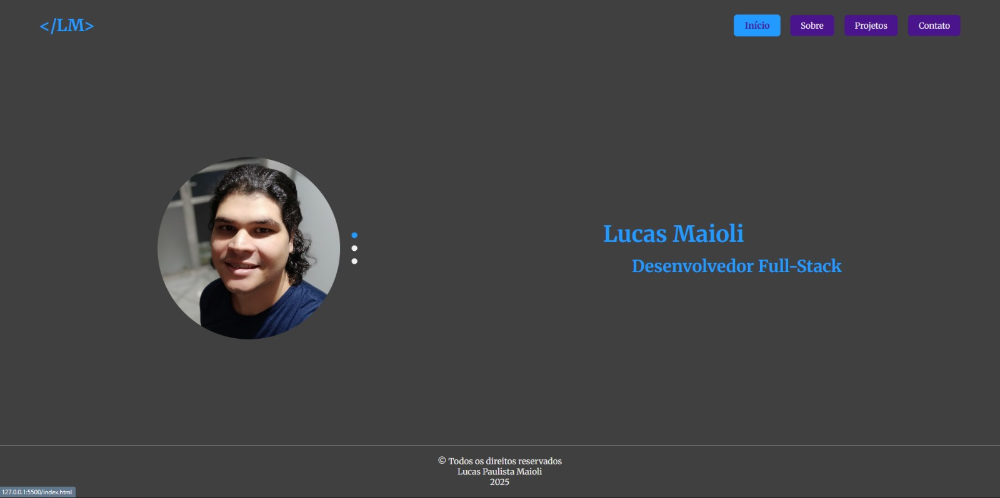

# Portfólio Pessoal - Lucas Maioli

> Projeto de portfólio pessoal desenvolvido para apresentar as minhas habilidades, projetos e jornada académica como estudante de Sistemas de Informação.

---

## 🚀 Demonstração Ao Vivo

Pode visualizar o projeto em funcionamento no seguinte link:

[**lucasmaioli.tech**](https://)

## 📸 Preview



---

## ✨ Features

O projeto conta com as seguintes funcionalidades:

* **Design Responsivo:** Layout adaptável para visualização em desktops, tablets e telemóveis.
* **Múltiplas Páginas:** Estrutura organizada com 4 páginas principais (Início, Sobre, Projetos e Contacto).
* **Componentes Dinâmicos em JavaScript:**
    * Carrossel de imagens na página inicial com transição automática a cada 5 segundos.
    * Carrossel de projetos com navegação manual.
    * Menu de navegação que destaca a página ativa.
* **Formulário de Contacto Funcional:** Integrado com o serviço [Formspree](https://formspree.io/) para envio de e-mails diretamente do site.
* **Código Organizado:** CSS com variáveis (`:root`) para fácil manutenção e estrutura semântica no HTML.

---

## 🛠️ Tecnologias Utilizadas

As seguintes tecnologias foram utilizadas na construção do projeto:

* **HTML5:** Estruturação semântica do conteúdo.
* **CSS3:** Estilização, layout com Flexbox e Grid, e responsividade com Media Queries.
* **JavaScript (Vanilla JS):** Manipulação do DOM para criar os componentes interativos.

---

## 📂 Como Executar o Projeto Localmente

Caso queira visualizar os ficheiros localmente, siga os passos abaixo:

```bash
# 1. Clone o repositório
git clone [https://github.com/Lucas-Maioli/Portfolio_Final.git](https://github.com/Lucas-Maioli/Portfolio_Final.git)

# 2. Navegue até ao diretório do projeto
cd Portfolio_Final

# 3. Após clonar, basta abrir qualquer um dos ficheiros .html diretamente no seu navegador. Para uma melhor experiência, recomenda-se o uso da extensão "Live Server" no Visual Studio Code.

👨‍💻 Autor
Lucas Paulista Maioli

GitHub: @Lucas-Maioli

LinkedIn: https://www.linkedin.com/in/lucas-maioli/

📄 Licença
Este projeto está sob a licença MIT. Veja o ficheiro LICENSE para mais detalhes.